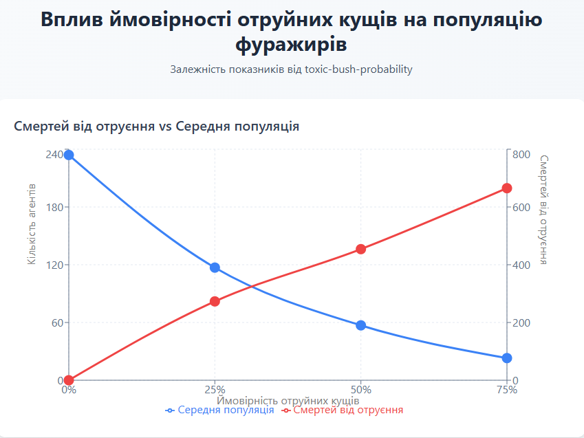
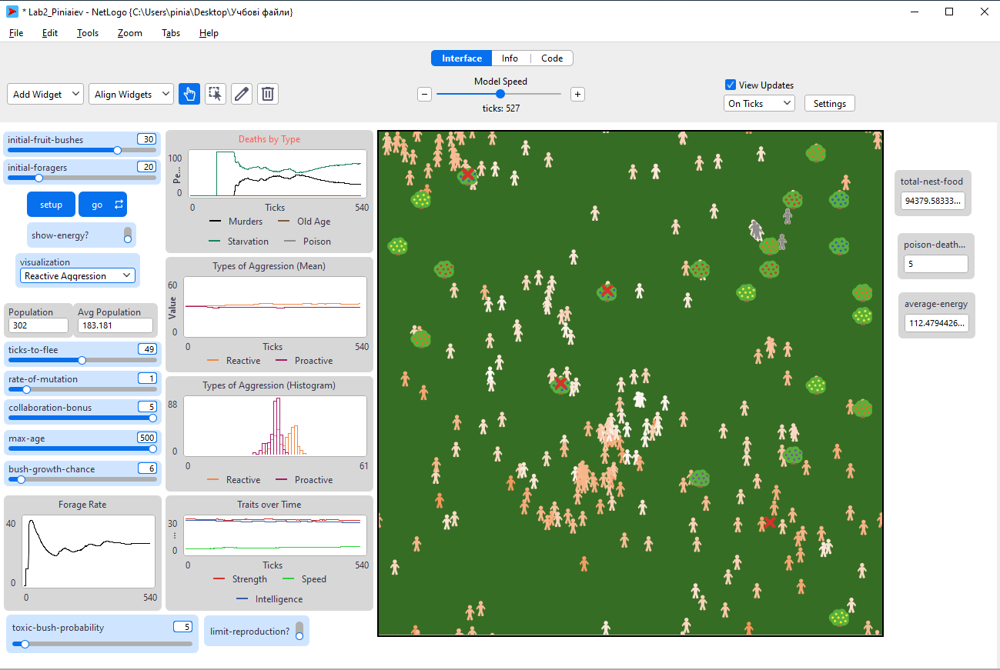

## Комп'ютерні системи імітаційного моделювання
## СПм-24-3, **Піняєв Євгеній**
### Лабораторна робота №**2**. Редагування імітаційних моделей у середовищі NetLogo

<br>

### Варіант 13, модель у середовищі NetLogo:
[Fruit Wars](https://www.netlogoweb.org/launch#http://www.netlogoweb.org/assets/modelslib/Sample%20Models/Social%20Science/Economics/Fruit%20Wars.nlogo)

<br>

### Внесені зміни у вихідну логіку моделі, за варіантом:

**1. Додавання отруйних кущів.**  
При створенні нового куща додається ймовірність, що він стане отруйним (визначається користувачем через слайдер `toxic-bush-probability`).  
У процедурі `grow-fruit-bushes`:
```netlogo
sprout-fruit-bushes 1
[
  set shape "Bush"
  ifelse (random-float 100 < toxic-bush-probability)
  [
    set color violet       ;; отруйні кущі позначаються фіолетовим кольором
    set amount 500 + random 501
    set toxic? true
  ]
  [
    set color one-of [ red blue orange yellow ]
    set amount 500 + random 501
    set toxic? false
  ]
  set size 3
]
```
Для цього було додано нову властивість до `fruit-bushes-own`:
```netlogo
fruit-bushes-own
[
  amount
  toxic?      ;; булева змінна — чи є кущ отруйним
]
```

**2. Реалізація наслідків отруєння.**  
Якщо форейджер (здобувач) потрапляє на отруйний кущ, після збору їжі він або помирає, або виживає з ослабленням.  
Зміни в процедурі `forage`:
```netlogo
ask one-of fruit-bushes in-radius 0.1
[
  set amount amount - 10
  if (amount < 0) [ die ]

  if toxic?
  [
    let survive? (random-float 1 < (strength / 50))
    ifelse (survive?)
    [
      set speed speed * 0.5       ;; тимчасове зниження швидкості
      set color brown
      set recovery-ticks 30        ;; тривалість ослаблення
    ]
    [
      set poison-death-count poison-death-count + 1
      hatch-deaths 1 [set color violet set shape "x" set age 0]
      die
    ]
  ]
]
```
Додано нові змінні:
```netlogo
foragers-own [
  recovery-ticks   ;; кількість тактів до відновлення після отруєння
]
globals [
  poison-death-count
]
```

**3. Відновлення після отруєння.**  
У тілі `move-foragers` реалізовано зменшення лічильника `recovery-ticks`. Коли агент повністю відновлюється, його колір повертається до сірого, а швидкість — до початкової.
```netlogo
if recovery-ticks > 0 [
  set recovery-ticks recovery-ticks - 1
  if recovery-ticks = 0 [
    set speed get-speed
    set color gray
  ]
]
```

**4. Відображення нового типу смертей "від отруєння".**  
Додано нову статистику:
```netlogo
globals [
  poison-death-count
  poison-death-rate
]
```
і у процедурі `go`:
```netlogo
set poison-death-rate 100 * poison-death-count /
  (murder-count + age-death-count + starvation-count + poison-death-count)
```

---

### Внесені зміни у вихідну логіку моделі, на власний розсуд:

**1. Додано показник зібраної їжі в гнізді.**  
Реалізовано глобальну змінну, що збільшується кожного разу при вдалому зборі:
```netlogo
globals [
  total-nest-food
]

to forage
  ...
  set total-nest-food total-nest-food + forage-rate
end
```
Значення змінної `total-nest-food` виводиться користувачеві через монітор NetLogo.  
Також реалізовано можливість **вимикати появу нових агентів** при досягненні певного запасу їжі (через чекбокс `limit-reproduction?`):

```netlogo
if limit-reproduction? and total-nest-food > 50000 [
  stop
]
```

---

**2. Реалізовано “адаптивну поведінку” агентів.**  
Якщо рівень агресії агента високий, він може відібрати частину енергії в сусіда з меншою силою.  
```netlogo
to steal-energy
  if random-float 1 < (proactive-aggression / 100) [
    let victim one-of other foragers in-radius 1
    if victim != nobody and [strength] of victim < strength [
      let stolen random 20
      set energy energy + stolen
      ask victim [ set energy energy - stolen / 2 ]
    ]
  ]
end
```
Цю процедуру викликають усі агенти в кінці свого ходу (`move-foragers`).  
Таким чином, агресивніші агенти мають більше шансів вижити, але загальна популяція стає менш стабільною.

---

**3. Вплив старіння на фізичні параметри агентів.**  
З віком сила (`strength`) поступово зменшується. Додано зміни в кінці кожного тіку в `move-foragers`:
```netlogo
set strength strength - 0.01
if strength < 1 [ set strength 1 ]
```
Це призводить до того, що старші агенти гірше перемагають у конфліктах і частіше гинуть від голоду чи отруєння.

---

### Обчислювальний експеримент

#### 1. Вплив імовірності появи отруйних кущів на смертність агентів

**Умови експерименту:**
- Початкова кількість кущів: 30  
- Початкова кількість агентів: 20  
- Імовірність отруйного куща (`toxic-bush-probability`): 0%, 25%, 50%, 75%  
- Інші параметри — стандартні.

**Результати:**
| toxic-bush-probability | Смертей від отруєння | Середня популяція | Середня енергія агентів |
|------------------------:|---------------------:|------------------:|------------------------:|
| 0%                     | 0                   | 234               | 96                    |
| 25%                    | 273                  | 117                | 107                    |
| 50%                    | 454                  | 57                | 179                     |
| 75%                    | 665                  | 23                 | 210                     |



**Висновок:**  
Зі збільшенням кількості отруйних кущів кількість смертей різко зростає, а середня популяція зменшується.  
Модель демонструє ефект природного відбору — виживають лише сильніші агенти.  
Водночас впроваджені зміни (адаптивна поведінка та старіння) підвищують різноманітність поведінки і стабільніше відображають біологічну динаміку популяції.



<br>
