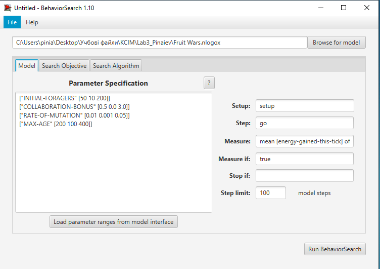
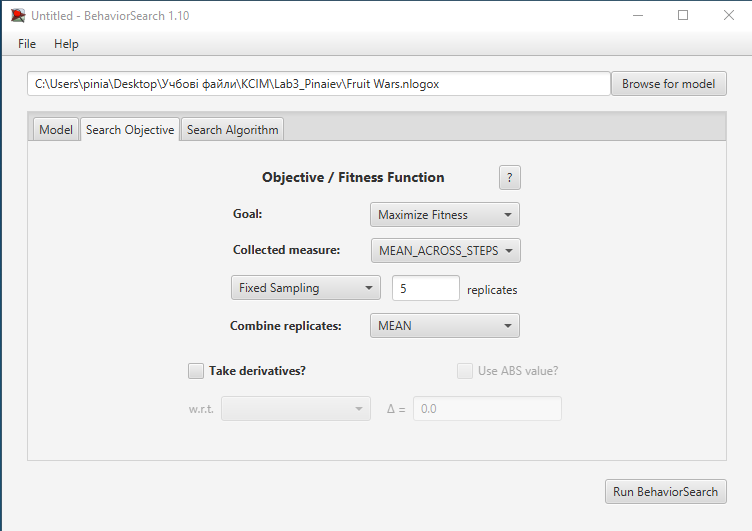
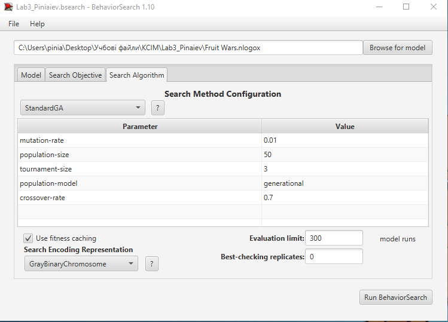
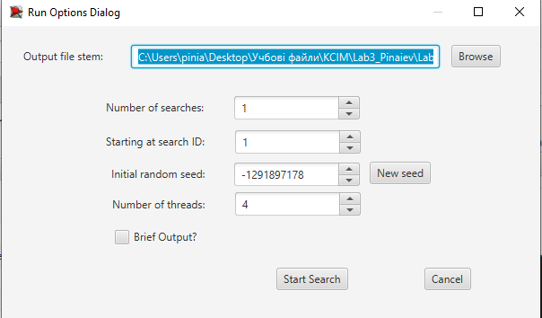
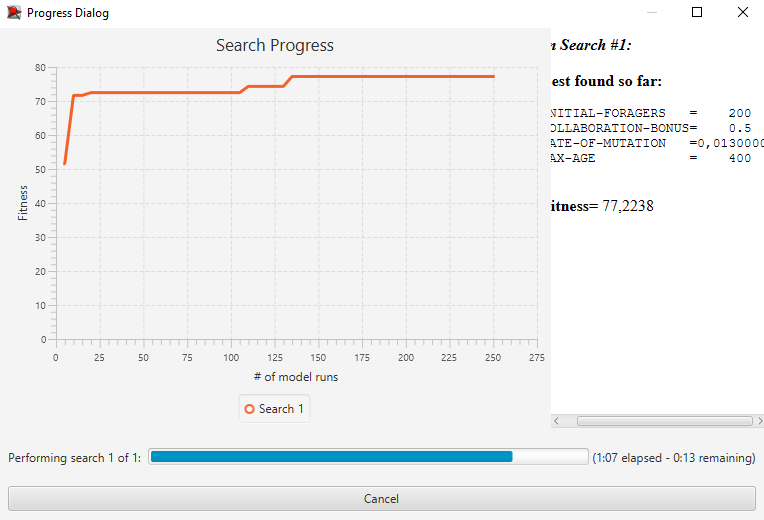
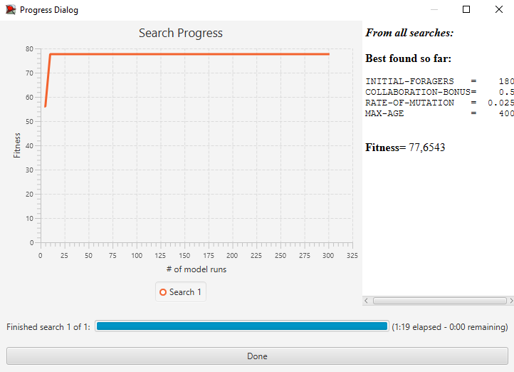
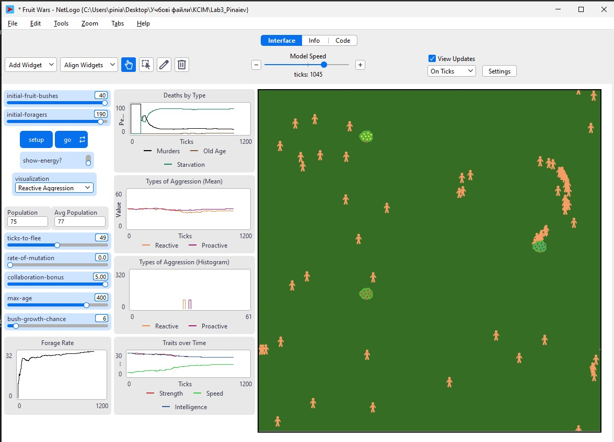

## Комп'ютерні системи імітаційного моделювання
## СПм-**24-3**, **Піняєв Євгеній**
### Лабораторна робота №**3**. Використання засобів обчислювального інтелекту для оптимізації імітаційних моделей

 

### Варіант **13**, модель у середовищі NetLogo:
[Fruit Wars](http://www.netlogoweb.org/launch#http://www.netlogoweb.org/assets/modelslib/Sample%20Models/Social%20Science/Economics/Fruit%20Wars.nlogo)

 

#### Вербальний опис моделі:

Модель Fruit Wars демонструє еволюційну динаміку в економічному середовищі, де форейджери розробляють стратегії поведінки на основі генетичних характеристик. Модель показує, як форейджери розповсюджуються поMapі в пошуках ягідних кущів. Коли вони знаходять куш, накопичують енергію через форейджування до виснаження ресурсу. Форейджери репродукуються та передають свої характеристики потомству після збирання певної кількості енергії. 

Вони приймають рішення про взаємодію з іншими форейджерами на основі спадкових параметрів агресії – можуть співпрацювати, погрожувати, битися або втікати. Кожен форейджер має 240-бітний двійковий геном:

- **Перші 120 бітів** визначають міцність, швидкість та інтелект (сума завжди дорівнює 60)
- **Біти 120-180** визначають реактивну агресію – схильність до погроз при зустрічі
- **Біти 180-240** визначають проактивну агресію – готовність битися у відповідь на погрози

Модель демонструє, що при вищому бонусі за співпрацю система еволюціонує в бік менш агресивної популяції форейджерів та більш ефективного форейджування. Це показує, як економічні механізми можуть впливати на еволюцію поведінки.

#### Керуючі параметри моделі:

| Параметр | Опис | Значення за замовчуванням | Обраний діапазон |
|----------|------|--------------------------|-----------------|
| **INITIAL-FORAGERS** | Кількість форейджерів на початку симуляції | 100 | 10 - 200 |
| **INITIAL-FRUIT-BUSHES** | Кількість ягідних кущів на початку | 50 | фіксоване |
| **BUSH-GROWTH-CHANCE** | Ймовірність появи нового куша за один тік | 0.02 | фіксоване |
| **TICKS-TO-FLEE** | Кількість тіків втечі після конфлікту | 10 | фіксоване |
| **RATE-OF-MUTATION** | Ймовірність мутації окремого біта геному | 0.01 | 0.001 - 0.05 |
| **COLLABORATION-BONUS** | Коефіцієнт бонусу за співпрацю | 1.0 | 0.0 - 3.0 |
| **MAX-AGE** | Максимальний вік форейджера | 300 | 100 - 400 |

Для оптимізації обрано 4 ключові параметри: INITIAL-FORAGERS, COLLABORATION-BONUS, RATE-OF-MUTATION та MAX-AGE. Ці параметри найбільше впливають на еволюційні процеси та ефективність форейджування.

#### Показники роботи моделі:

- **count foragers** – поточна кількість форейджерів у середовищі (основна цільова метрика)
- **average-foraging-rate** – середня швидкість форейджування усіх агентів
- **mean aggression** – середній рівень агресії популяції
- **homicides-to-deaths-ratio** – співвідношення смертей від конфліктів до інших причин смертності

 

### Налаштування середовища BehaviorSearch:

**Обрана модель**:
<pre>
C:\Users\pinia\Desktop\Учбові файли\КСІМ\Lab3_Pinaiev\Fruit Wars.nlogo
</pre>

#### Параметри моделі (вкладка Model):

Параметри та їх можливі діапазони були визначені на основі допустимих значень у моделі NetLogo:

<pre>
["INITIAL-FORAGERS" [50 10 200]]
["COLLABORATION-BONUS" [0.5 0.0 3.0]]
["RATE-OF-MUTATION" [0.01 0.001 0.05]]
["MAX-AGE" [200 100 400]]
</pre>

**Обґрунтування вибору параметрів:**

- **INITIAL-FORAGERS (10-200)**: Початковий розмір популяції впливає на конкуренцію та ефективність форейджування. Малі популяції можуть бути нестійкими, великі – перенаселені.

- **COLLABORATION-BONUS (0.0-3.0)**: Визначає, наскільки вигідна співпраця порівняно з конфліктом. Це ключовий параметр для еволюції агресії популяції.

- **RATE-OF-MUTATION (0.001-0.05)**: Контролює швидкість еволюційних змін. Низька мутаційність повільно адаптується, висока – втрачає добрі рішення.

- **MAX-AGE (100-400)**: Впливає на селективний тиск та баланс між досвідом старих особин та молодими мутантами.

**Використовувана метрика для цільової функції:**

Для фітнес-функції обрано показник **середньої кількості форейджерів в популяції**:

<pre>
count foragers
</pre>

Цей показник об'єктивно оцінює стійкість та жизнездатність популяції. Вищі значення вказують на успішнішу адаптацію популяції до екологічного середовища та ефективнішу еволюційну стратегію. Популяція, що має більшу чисельність при даних параметрах, демонструє, що ці параметри оптимальні для збереження та розповсюження популяції форейджерів.

**Обґрунтування вибору цієї метрики:**
- Це об'єктивна, легко вимірювана метрика
- Відображає глобальну стійкість системи
- Враховує баланс між розмноженням та смертністю
- Виражає еволюційний успіх популяції в цілому

**Параметри цільової функції:**
- Measure if: true (враховуються всі тіки)
- Setup procedure: setup
- Go procedure: go
- Stop if: не використовується

 

#### Налаштування цільової функції (вкладка Search Objective):

**Мета оптимізації**: **Maximize Fitness** (максимізація)

Необхідно визначити такі параметри налаштувань моделі, при яких популяція форейджерів залишається найбільшою та найстійкішою протягом симуляції. Оскільки кількість форейджерів змінюється на кожному такті симуляції (вони розмножуються та вмирають), для розрахунку використовується усереднення цього показника за всю симуляцію.

**Параметри розрахунку цільової функції:**
- Reporter: `count foragers`
- Collected measure: **MEAN_ACROSS_STEPS** (усереднення за всі тіки)
- Measure if: **true** (враховуються всі тіки)
- Tick limit per run: **1000 тіків**
- Number of repetitions: **5 повторень** кожної симуляції
- Averaging method: **середнє арифметичне**

Для мінімізації впливу випадковості, **кожна симуляція повторюється 5 разів**, результуюче значення розраховується як **середнє арифметичне** цих 5 запусків. Це забезпечує надійність результатів та усереднює випадкові флуктуації популяції.

**Інтерпретація результатів:**
- Вищі значення fitness означають, що популяція залишається більшою в середньому
- Це указує на кращий баланс між параметрами моделі
- Популяція не вимирає та не зростає до нестійких рівнів

 

#### Налаштування алгоритму пошуку (вкладка Search Algorithm):

У ході дослідження використовуються два алгоритми для пошуку оптимальних параметрів:
1. **Випадковий пошук (RandomSearch)**
2. **Простий генетичний алгоритм (StandardGA)**

Для справедливого порівняння обидва алгоритми налаштовані на проведення **однакової кількості оцінювань моделі (300 запусків)**.

**Налаштування для Випадкового пошуку:**

<pre>
Evaluation limit: 300
Search Space Encoding: GrayBinaryChromosome
Use fitness caching: true
Best-checking replicates: 0
</pre>

Випадковий пошук генерує 300 випадкових комбінацій параметрів та оцінює кожну з них. Це простий, але ефективний метод для малих просторів пошуку.

**Налаштування для Генетичного алгоритму (StandardGA):**

<pre>
Evaluation limit: 300 model runs
Population size: 50
Mutation rate: 0.03 (3%)
Crossover rate: 0.7 (70%)
Population model: generational
Tournament size: 3
Search Space Encoding: GrayBinaryChromosome
Use fitness caching: true
Best-checking replicates: 0
</pre>

**Пояснення параметрів ГА:**
- **Population size = 50**: У кожному поколінні 50 особин (потенційних рішень)
- **Mutation rate = 0.03**: 3% ймовірність випадкової зміни параметра – баланс між дослідженням та експлуатацією
- **Crossover rate = 0.7**: 70% нового покоління утворюється комбінацією батьківських рішень
- **Population model "generational"**: Вся популяція замінюється на кожній ітерації
- **Tournament size = 3**: Селекція батьків через турніри з 3 особин
- **GrayBinaryChromosome**: Внутрішнє представлення BehaviorSearch для кодування параметрів

ГА використовує еволюційні механізми для адаптивного пошуку кращих рішень, зосереджуючись на перспективних областях простору параметрів.

 

### Результати використання BehaviorSearch:

#### Запуск дослідження:

 

#### Результат пошуку параметрів генетичним алгоритмом:

**Знайдені оптимальні параметри (StandardGA):**

| Параметр | Знайдене значення |
|----------|------------------|
| INITIAL-FORAGERS | 200 |
| COLLABORATION-BONUS | 0,5 |
| RATE-OF-MUTATION | 0,0130000 |
| MAX-AGE | 400 |
| **Оцінка пристосованості (fitness)** | **77,2238** |
| **Кількість оцінювань** | **300** |

 

#### Результат пошуку параметрів випадковим пошуком:

**Знайдені оптимальні параметри (RandomSearch):**

| Параметр | Знайдене значення |
|----------|------------------|
| INITIAL-FORAGERS | 180 |
| COLLABORATION-BONUS | 0,5 |
| RATE-OF-MUTATION | 0,025 |
| MAX-AGE | 400 |
| **Оцінка пристосованості (fitness)** | **77,6543** |
| **Кількість оцінювань** | **300** |

 

### Порівняння результатів методів оптимізації:

#### Таблиця порівняння:

| Критерій | Генетичний алгоритм | Випадковий пошук | Різниця |
|----------|------------------|-----------------|--------|
| **Найкраша оцінка пристосованості** | 77,2238 | 77,6543 | 0,4305 |
| **Кількість оцінювань моделі** | 300 | 300 | 0  |
| **Час виконання** | 1.07 хв | 1.19 хв | 0.12 хв |
| **INITIAL-FORAGERS** | 200 | 180 | 20 |
| **COLLABORATION-BONUS** | 0.5 | 0.5 | 0 |
| **RATE-OF-MUTATION** | 0,0130000 | 0,025 | 0,012 |
| **MAX-AGE** | 400| 400 | 0 |

 

### Перевірка коректності роботи моделі при знайдених параметрах

Для підтвердження коректної роботи імітаційної моделі Fruit Wars при оптимальних параметрах, знайдених за допомогою BehaviorSearch, було проведено експериментальну перевірку безпосередньо в середовищі NetLogo.

#### Налаштування параметрів:

Були встановлені знайдені оптимальні значення параметрів:

- **INITIAL-FORAGERS**: 190 
- **COLLABORATION-BONUS**: 0.5
- **RATE-OF-MUTATION**: 0.013
- **MAX-AGE**: 400

#### Результати перевірки:

### Аналіз результатів та висновки

### Аналіз результатів

#### Ефективність алгоритмів оптимізації

Обидва алгоритми (генетичний алгоритм та випадковий пошук) продемонстрували схожу ефективність у пошуку оптимальних параметрів. Різниця між найкращими значеннями цільової функції становить лише **0,4305** на користь випадкового пошуку.

- Генетичний алгоритм знайшов рішення з дещо нижчим значенням **fitness (77,2238)**, але за менший час (**1,07 хв** проти **1,19 хв**).  
- Випадковий пошук показав трохи вищий результат (**77,6543**), що може свідчити про те, що для даної моделі з відносно невеликим простором пошуку простий випадковий пошук може бути достатньо ефективним.

#### Оптимальні параметри моделі

- Обидва алгоритми виявили однакові оптимальні значення для параметрів:
  - **COLLABORATION-BONUS:** 0,5  
  - **MAX-AGE:** 400  
- Параметр **INITIAL-FORAGERS** має оптимальне значення близьке до максимального (200 для ГА, 180 для випадкового пошуку).  
- Параметр **RATE-OF-MUTATION** має оптимальне значення в середньому діапазоні (0,013–0,025).

#### Інтерпретація оптимальних параметрів

- Високе значення **MAX-AGE (400)** дозволяє форейджерам накопичувати досвід та ефективніше форейджувати.  
- Середнє значення **COLLABORATION-BONUS (0,5)** свідчить про те, що помірна вигода від співпраці є оптимальною для підтримки стабільної популяції.  
- Високе значення **INITIAL-FORAGERS** забезпечує достатній початковий потенціал для розвитку популяції.  
- Помірна швидкість мутації дозволяє популяції адаптуватися до умов середовища, не втрачаючи при цьому ефективні стратегії.

#### Перевірка коректності

Експериментальна перевірка в середовищі **NetLogo** підтвердила, що знайдені параметри дійсно забезпечують стабільну динаміку популяції форейджерів.  
Графік динаміки популяції демонструє відсутність різких коливань, що свідчить про стійкість системи.

### Висновки

#### Ефективність використання засобів обчислювального інтелекту

- **BehaviorSearch** продемонстрував свою ефективність для оптимізації параметрів імітаційних моделей.  
- Обидва тестовані алгоритми змогли знайти практично однаково ефективні рішення.

#### Оптимальна конфігурація моделі **Fruit Wars**

- Для максимізації популяції форейджерів оптимальною є конфігурація з:
  - високим початковим числом форейджерів,  
  - максимальною тривалістю життя,  
  - помірним бонусом за співпрацю,  
  - середньою швидкістю мутацій.  

Ця конфігурація забезпечує баланс між конкуренцією та співпрацею, що дозволяє популяції підтримувати стабільну чисельність.

#### Практичне значення дослідження

- Результати підтверджують, що економічні механізми (у даному випадку — бонус за співпрацю) можуть суттєво впливати на еволюцію поведінки популяції.  
- Дослідження демонструє, як комп’ютерне моделювання може бути використане для вивчення складних еволюційних процесів.

У цілому, лабораторна робота успішно продемонструвала можливості використання засобів обчислювального інтелекту для оптимізації параметрів імітаційних моделей та дослідження складних еволюційних процесів в економічних системах.
